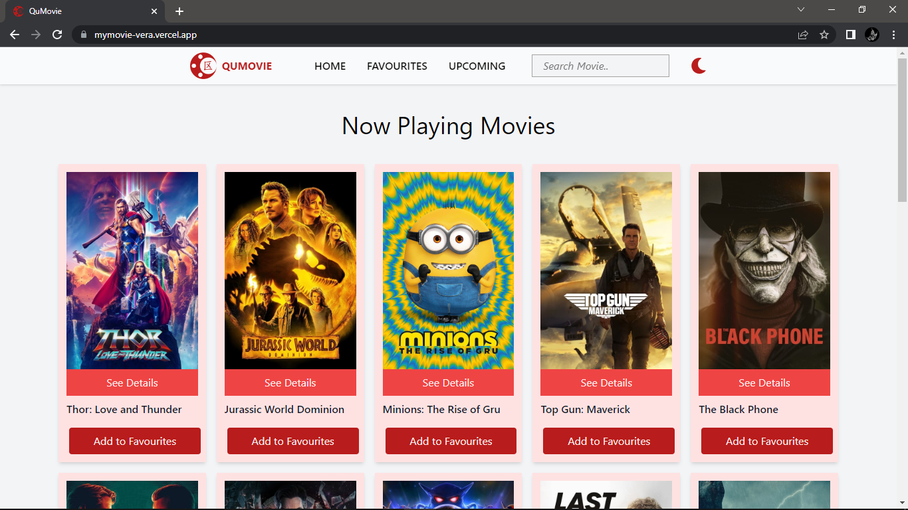

     
        

# QuMovie

<strong>This project is a web application for movie lists.</strong>

 

## Language and Tools

    &nbsp;
    &nbsp;
    &nbsp;
    &nbsp;
    &nbsp;
    &nbsp;
    &nbsp;
    &nbsp;
    &nbsp;
    &nbsp;

 
 

## Deployment

This project deployed in Vercel: https://mymovie-vera.vercel.app/
 
 

 
 

## Deploy on Local

In the project directory, you can run:

### `npm start`

Runs the app in the development mode.\
Open [http://localhost:3000](http://localhost:3000) to view it in your browser.

 

## About Me

Hi! I'm Vera, find me on:

    <a href="https://github.com/Verasoniya/ ">
        &nbsp; Github
    </a>

    <a href="https://linkedin.com/in/septi-vera-soniya-737731246/ ">
        &nbsp; Linked In
    </a>

